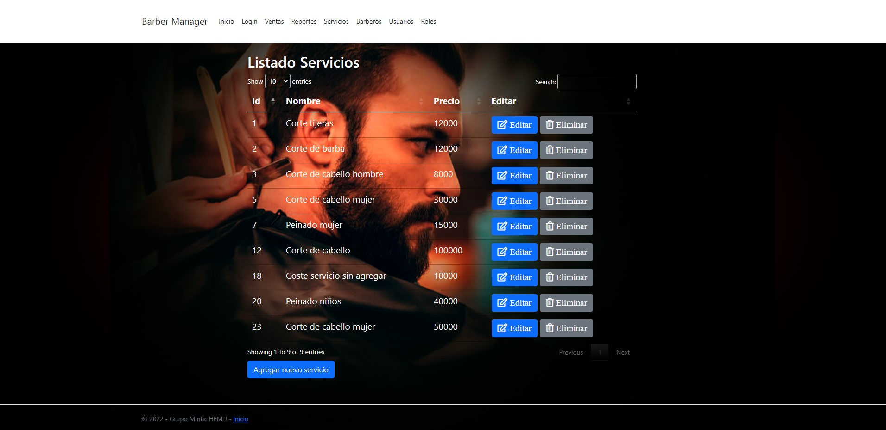

# Aplicacion para el manejo de negocio de barberia
Esta aplicación web facilita la administración de negocios de barbería. 

Características:
* Uso de login para usuarios de administración y  recepción
* Permite el manejo de servicios
* Entrega reportes en periodos de tiempo

Para correr la applicación basta con instalar .NET 6.0, ubicarse en la carpeta BarberManager > Fontend y usar el comando `dotnet run`.

Documentacion del proceso de desarrollo usando metodología SCRUM:
* https://www.notion.so/BARBER_MANAGER-076be2a7e7ab4417a254974cebd5dbff
---
Desarrollado con .NET 6.0
